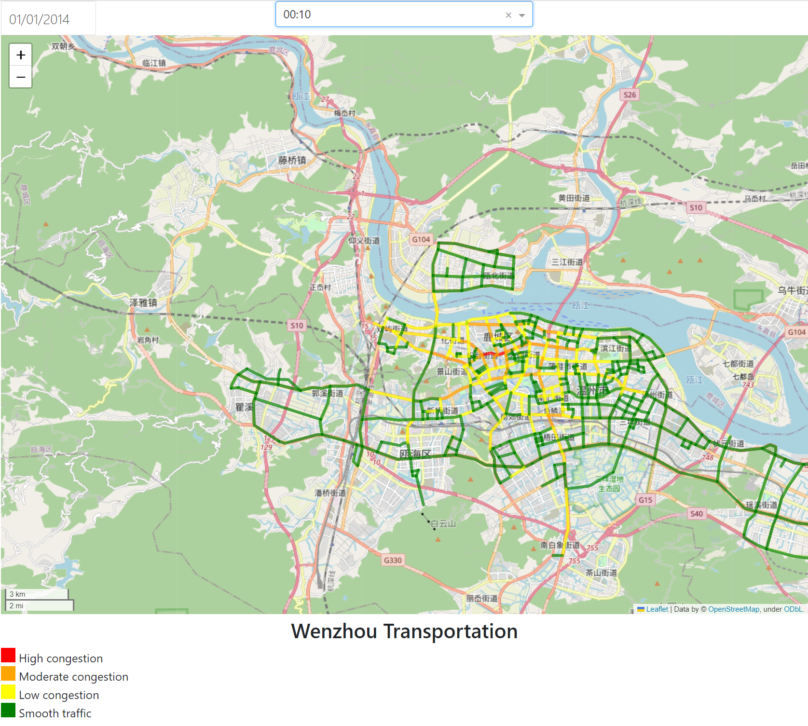

# Task2 Traffic data visualization

## Data preprocess
There are many SQL with insert in the .sql document provided, which is inefficient. So I provide several ways to address with this problem:
+ Use transaction
+ Convert single insert to multiple inserts
+ **Use json format**

## Works
+ use **folium** to present the data. However, it only provide the static HTML without interactivity.
+ Introduce **dash** to enable interactivity.

